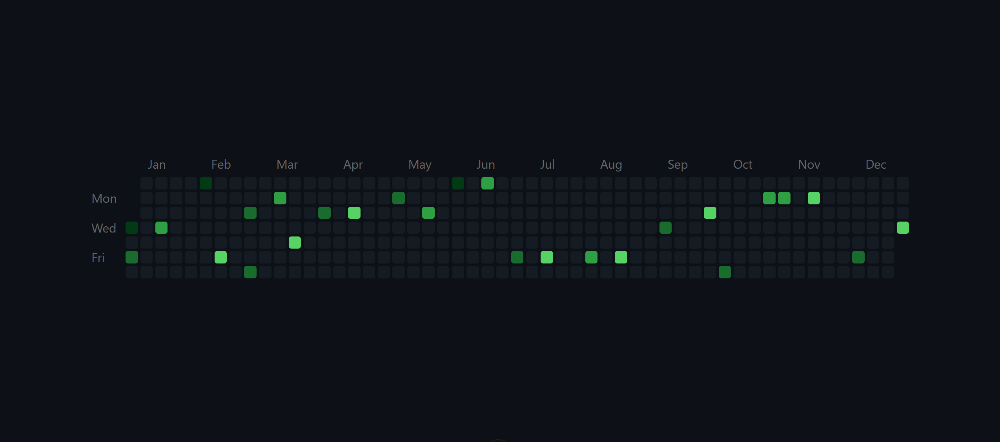

# 📦 vue-heatmap-table

A flexible heatmap component for visualizing day-by-day activity across a year — like GitHub contribution graphs.

## Preview



## 🚀 Installation

```bash
npm install vue-heatmap-table
```

## 🔧 Usage

```ts
// main.ts
import "vue-heatmap-table/dist/vue-heatmap-table.css";
```

```vue
<template>
  <HeatmapTable :data="sampleData" />
</template>

<script setup lang="ts">
import HeatmapTable from "vue-heatmap-table";

const sampleData = {
  "2025-01-01": 1,
  "2025-02-03": 3,
  "2025-04-15": 6,
  "2025-12-31": 2,
};
</script>
```

---

## 🧩 Props

| Name              | Type                     | Description                                                                                                                                                                         | Default              |
| ----------------- | ------------------------ | ----------------------------------------------------------------------------------------------------------------------------------------------------------------------------------- | -------------------- |
| `year`            | `number`                 | Year to display                                                                                                                                                                     | current year         |
| `data`            | `Record<string, number>` | Object with activity values for each day (`YYYY-MM-DD` format). Values can be any non-negative numbers — color intensity will be mapped proportionally based on the provided range. | `{}`                 |
| `cellSize`        | `string`                 | Size of each cell (`px`, `rem`, etc.)                                                                                                                                               | `'14px'`             |
| `cellRadius`      | `string`                 | Border-radius of each cell                                                                                                                                                          | `'3px'`              |
| `cellGap`         | `string`                 | Gap between cells (e.g. `'2px'` or `'20%'`)                                                                                                                                         | `'20%'`              |
| `emptyColor`      | `string`                 | Background color for days with zero activity                                                                                                                                        | `'#151b23'`          |
| `colorPalette`    | `string[]`               | Array of colors from low to high activity                                                                                                                                           | GitHub green palette |
| `visibleWeekDays` | `number[]`               | Indexes of visible weekdays (0 = Sun, 1 = Mon, ..., 6 = Sat)                                                                                                                        | `[1, 3, 5]`          |
| `fontSize`        | `string`                 | Font size for labels                                                                                                                                                                | `'14px'`             |
| `fontColor`       | `string`                 | Font color                                                                                                                                                                          | `'#666'`             |
| `locale`          | `string`                 | Locale for weekday/month labels (e.g. `'en'`, `'ru'`, `'fr'`)                                                                                                                       | `'en'`               |

---

## 🧪 Full Example

```vue
<template>
  <HeatmapTable
    :data="data"
    :year="2025"
    cellSize="10px"
    cellRadius="2px"
    cellGap="15%"
    :colorPalette="['#1b1f23', '#005f1f', '#0a7f2f', '#2ea043', '#56d364']"
    emptyColor="#1b1f23"
    :visibleWeekDays="[1, 2, 3, 4, 5]"
    fontSize="12px"
    fontColor="#999"
    locale="ru"
  />
</template>

<script setup lang="ts">
import HeatmapTable from "vue-heatmap-table";
import "vue-heatmap-table/dist/vue-heatmap-table.css";

const data = {
  "2025-01-01": 1,
  "2025-02-03": 3,
  "2025-04-15": 6,
  "2025-12-31": 2,
};
</script>
```

---

## 📅 How It Works

- The `data` prop takes values between `0` (no activity) and `1` (max activity).
- The background color is selected from `colorPalette` based on activity level.
- Cells outside the selected year are invisible.
- Month and weekday labels auto-localize via `Intl.DateTimeFormat`.

---

## 🌍 Localization

To switch languages, simply pass the desired locale code:

```ts
locale = "en"; // or "ru", "fr", "de", etc.
```

---

## 📄 License

MIT

---

Made with ❤️ by Monshoux
